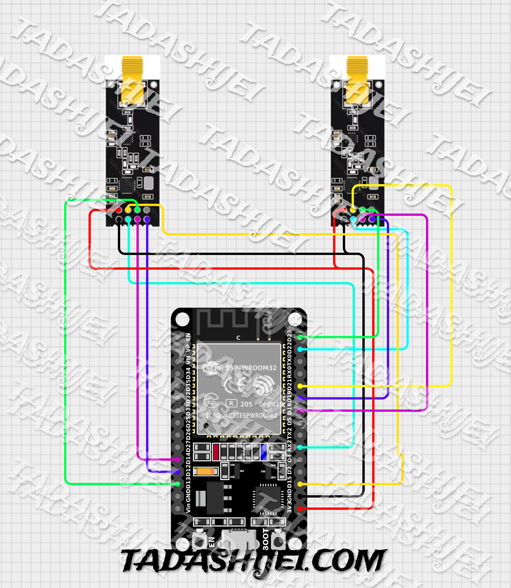

## Arashi-Ao READE.ME

**Welcome to Arashi-Ao!**

Arashi-Ao (meaning "Storm Blue" in Japanese) is an educational tool designed to explore the world of Bluetooth jamming. This document guides you through the hardware components and software setup to utilize Arashi-Ao for educational purposes only.

**Hardware Required:**

* ESP32 Development Board (with at least 30 usable GPIO pins)
* 2x nRF24L01+ Wireless Transceiver Modules
* (Optional) 2x 10uF 16v Capacitors (for nRF24L01 power stabilization)
* Jumper Wires
* Breadboard (recommended for prototyping)
* Power Supply for ESP32 (e.g., USB cable, battery pack)

**Software Required:**

* Arduino IDE (https://support.arduino.cc/hc/en-us/articles/360019833020-Download-and-install-Arduino-IDE)
* Appropriate libraries for ESP32 and nRF24L01 (specific libraries will depend on chosen software)

**Assembly (Optional):**

1. If using a breadboard, connect the ESP32 according to its pinout diagram.
2. Connect the nRF24L01 modules to the ESP32 using jumper wires. Refer to the chosen library's documentation for specific pin connections (typically SPI communication pins).
3. (Optional) Solder the 10uF capacitors across the VCC and GND pins of each nRF24L01 module for improved power stability.

**Software Setup:**

1. Install the Arduino IDE and any necessary libraries for ESP32 and nRF24L01 communication.
2. Download the Arashi-Ao software code (not provided in this READE.ME, obtain from a reputable source).
3. Open the code in the Arduino IDE.
4. Update the code with any necessary configurations (e.g.,  adjustable power settings for disruption range).
5. Compile and upload the code to your ESP32 board.

**Operation:**

1. Power on the ESP32 board.
2. The Arashi-Ao should initialize and potentially display LED status indicators (refer to the code documentation for LED behavior).
3. Depending on the software implementation, you might need to adjust settings through a serial monitor or physical buttons to control the disruption range.
4. Observe the effects of the jamming on nearby Bluetooth devices within the range.

**Additional Resources:**

* ESP32 Documentation: https://docs.espressif.com/projects/esp-idf/en/stable/esp32/index.html
* nRF24L01+ Datasheet: https://infocenter.nordicsemi.com/index.jsp

**Enjoy exploring the world of Bluetooth with Arashi-Ao! Remember, responsible use and legal compliance are paramount.**

**PRIVATE USE ONLY! NOT AVAILABLE ON THE PUBLIC!**
